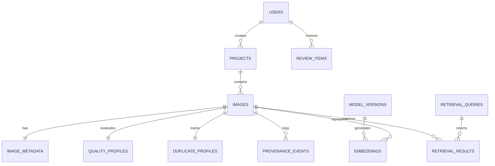

# SCI-INTEL Platform Architecture Specification
## AI-Powered Scientific Imaging Intelligence Platform for Scanning Electron Microscopy

---

## 1. System Overview

The **SCI-INTEL** platform is built on a clean three-tier architecture:
1. **Presentation Layer**: React 18 Single-Page Application (SPA) written in TypeScript, featuring interactive canvas viewers, live telemetry dashboards, and the Curator Workbench.
2. **Application & Inference Layer**: FastAPI ASGI service with modular domain routers, dependency-injected security, and singleton ML inference engines.
3. **Data & Storage Layer**: Relational database (SQLAlchemy 2.0 ORM with SQLite/PostgreSQL), memory-mapped FAISS vector index, and content-addressable filesystem storage.

```
+--------------------------------------------------------------------------+
|                        RESEARCHER / CURATOR UI                           |
|  [Dashboard] [Explorer] [Deep Viewer] [Vector Search] [Curator Workbench]|
+--------------------------------------------------------------------------+
                                     | HTTP / JSON REST
                                     v
+--------------------------------------------------------------------------+
|                         FASTAPI BACKEND SERVICE                          |
|  +--------------------------------------------------------------------+  |
|  | Routers: /auth, /images, /search, /curation, /models, /provenance  |  |
|  +--------------------------------------------------------------------+  |
|  | Core Services: IngestionService, AuditService, ProvenanceService    |  |
|  +--------------------------------------------------------------------+  |
|  | ML Engines: DINOv2Engine, Phase4Engine, FAISSEngine, QualityEngine |  |
|  +--------------------------------------------------------------------+  |
+--------------------------------------------------------------------------+
                     |                                    |
          SQLAlchemy | ORM                     Filesystem | Storage
                     v                                    v
+-----------------------------+         +----------------------------------+
|     RELATIONAL DATABASE     |         |    CONTENT-ADDRESSABLE STORAGE   |
| - images, image_metadata    |         | originals/ {sha256}.ext          |
| - quality_profiles          |         | thumbnails/ {sha256}_thumb.png   |
| - duplicate_profiles        |         | thumbnails/ {sha256}_display.png |
| - embeddings (384-d)        |         | indexes/ faiss_exact_flatip.idx  |
| - provenance_events, audits |         |                                  |
+-----------------------------+         +----------------------------------+
```

---

## 2. Frontend Architecture

### 2.1 Technology Stack & Structure
- **Framework**: React 18.2 with TypeScript 4.9.5.
- **Routing**: React Router DOM v6 with route-level permission checks.
- **Icons & Styling**: Lucide React with zero external UI bloat; styled using CSS variables from a clean design tokens system (`tokens.css` and `globals.css`).
- **Network Layer**: Strongly typed singleton `ApiClient` with automated JWT header injection, response normalization, and network error handling.

### 2.2 Component Hierarchy
```
App (Router, Token State, Layout Container)
├── Navbar (Global Navigation, Real-Time Status Indicator, User Profile)
├── Sidebar (Module Navigation, Quick Metric Summaries)
├── Pages
│   ├── Dashboard (Research Milestone Overview, Live System Health)
│   ├── Projects (Collection Explorer, Metadata Filter, JSON Exporter)
│   ├── Upload (Multi-Part File Ingestion, Benchmark Sample Loader)
│   ├── ImageDetail (Canvas Zoom/Pan, Pixel Inspector, Spectral FFT HUD)
│   ├── Search (Vector/Hybrid Retrieval, Dual Representation, Side-by-Side Comparison)
│   ├── MultiImageAnalysis (N-Micrograph Cohort Analysis, NxN Matrix, Redundancy Groups, Comparative Quality)
│   ├── Curation (Integrity Filter, Cascade Statistics)
│   ├── ReviewQueue (Curator Workbench, Keyboard Triage, Evidence Logging)
│   ├── ModelsView (Checkpoint Verification, Feature Probing, Cosine Comparator)
│   └── SettingsView (Diagnostics, Storage Audit, Health Telemetry)
└── Footer (Master Seal Cryptographic Hashes, Versioning)
```

---

## 3. Backend Architecture

### 3.1 Framework & Middleware
- **FastAPI 0.115+**: Async request handling with automatic OpenAPI documentation.
- **Lifespan Manager**: Startup diagnostics validating DB connectivity (`SELECT 1`), model registry integrity, and SHA-256 checkpoint verification (`53ba60a3...`).
- **Production Observability Middleware**:
  - Injects unique `X-Request-ID` UUID per request.
  - Client IP rate limiting (10,000 req/min for interactive inspection; loopback and static image asset exempt).

### 3.2 Service Layer Pattern
- **`IngestionService`**: Orchestrates the atomic 14-step ingestion pipeline (validation, hashing, storage, metadata extraction, contrast display generation, quality analysis, dual embedding extraction, deduplication cascade, indexing, and novelty scoring).
- **`MultiImageComparisonService`**: Orchestrates comparative workflows across $N$ micrographs ($N \ge 2$), executing:
  - *Pipeline A (Redundancy Cascade & Grouping)*: Computes $N(N-1)/2$ unique pairwise comparisons, stages 1–5 duplicate cascade (`DUPLICATE`, `NEAR_DUPLICATE`, `SIMILAR`, `DISTINCT`), builds $N \times N$ similarity matrix, and performs graph-based clustering electing representative micrographs (advisory strictly prohibiting automated deletion).
  - *Pipeline B (Quality-Risk & Corrective-Action Triage)*: Calculates handcrafted image-derived quality indicators, extracts model-derived suspicious region envelopes, retrieves comparable evidence cohorts ($N=55$), ranks micrographs by composite risk, and generates peer-referenced comparative corrective actions.
- **`ProvenanceService`**: Immutably records every operational and human review lifecycle event into `provenance_events`.
- **`AuditService`**: Logs administrative, access, and search events to `audit_logs`.
- **`ModelRegistryService`**: Verifies cryptographic checksums of model checkpoints before serving.

---

## 4. Dual Representation Architecture

To prevent the confounding of general visual features with acquisition-specific artifacts, SCI-INTEL implements a strictly decoupled dual-representation system:

```
               Input Micrograph (224 x 224 x 3)
                              |
                              v
             +----------------------------------+
             |     DINOv2 ViT-S/14 (Frozen)     |
             |   384-dimensional feature pool   |
             +----------------------------------+
                              |
               +--------------+--------------+
               |                             |
               v                             v
+-------------------------------+ +------------------------------------+
|     REPRESENTATION 1          | |          REPRESENTATION 2          |
|    DINOv2 Foundation Base     | |     Phase 4 Acquisition Adapter    |
| - General visual similarity   | | - Linear projection head           |
| - Focus & blur risk scoring   | | - Cross-voltage gap reduction      |
| - 14x14 patch attention grid  | | - Specialized microscopy retrieval |
| - Stored: 'dinov2_base'       | | - Stored: 'phase4_adapted'         |
+-------------------------------+ +------------------------------------+
```

### Deterministic Rule-Based Composition
- **No Learned Fusion**: Representations are never passed through a multi-task black-box neural layer.
- **Explicit Routing**:
  - Quality and artifact screening exclusively reads DINOv2 base features.
  - Acquisition-aware retrieval queries the Phase 4 adapter embeddings.
  - Hybrid queries combine Phase 4 cosine similarity with deterministic acquisition metadata filters ($0.0 \le \alpha \le 1.0$).

---

## 5. Database Schema & Entity Relationships

The relational data model is fully normalized across 12 core tables:



### Key Relational Tables:
- `images`: Canonical asset registry (`id`, `sha256`, `storage_path`, `thumbnail_path`, `width`, `height`, `file_size`, `processing_status`).
- `image_metadata`: Physical instrument parameters (`microscope`, `detector`, `accelerating_voltage_kv`, `magnification`, `pixel_size_nm`, `completeness`).
- `quality_profiles`: 6 image-derived indicators (`laplacian_variance`, `edge_density`, `shannon_entropy`, `dynamic_range`, `clipping_ratio`, `high_freq_fft_ratio`, `composite_quality_risk`, `quality_label`).
- `duplicate_profiles`: Multi-stage cascade status (`phash`, `dhash`, `duplicate_status`, `matched_image_id`, `similarity_score`, `match_stage`).
- `embeddings`: 384-d normalized float vectors labeled by `embedding_type` (`dinov2_base` vs `phase4_adapted`).
- `provenance_events`: Immutable audit trail (`image_id`, `event_type`, `software_version`, `model_version`, `parameters`, `timestamp`).

---

## 6. Vector Indexing and Retrieval Design

- **Index Engine**: FAISS (`IndexFlatIP`) configured for 384-dimensional unit vectors.
- **Mathematical Equivalence**: Because all vectors are $L_2$-normalized during ingestion ($\|v\|_2 = 1$), the inner product $\langle u, v \rangle$ is exactly equivalent to cosine similarity:
  $$\text{CosineSimilarity}(u, v) = \frac{u \cdot v}{\|u\| \|v\|} = u \cdot v$$
- **Atomic Index Versioning**: `VersionedIndexManager` writes indices to `.tmp` files and executes atomic replacement (`os.replace`), generating SHA-256 manifests to allow non-destructive rollback.

---

## 7. Security, Integrity & Storage

- **Authentication**: JWT tokens signed using HMAC-SHA256 with configurable expiry (`ACCESS_TOKEN_EXPIRE_MINUTES`).
- **Role-Based Authorization**: `RoleChecker(["CURATOR", "ADMIN"])` guards review submissions, metadata corrections, and administrative diagnostics.
- **Input Sanitization**: File uploads are strictly validated against extension whitelists (`.tif`, `.tiff`, `.png`, `.jpg`), maximum byte limits ($100\text{ MB}$), and path traversal patterns (`..`, `/`, `\`).
- **Immutable Storage Hierarchy**:
  ```
  platform/storage/
  ├── originals/       # {sha256}.{ext} (Read-only, bit-exact raw microstructural data)
  ├── thumbnails/      # {sha256}_thumb.png (256x256), {sha256}_display.png (8-bit contrast)
  ├── indexes/         # faiss_exact_flatip.index, id_map.json, active_index_manifest.json
  └── scidata_platform.db
  ```

---

## 8. Alignment with Frozen Scientific Evidence (Phases 1–9)

The SCI-INTEL platform serves as the production software interface for the sealed scientific findings:
- **Phase 1 Dataset**: All 4,000 BBBC021/HCCI micrographs ingested match Phase 1 frozen SHA-256 manifests.
- **Phase 2 Baseline**: DINOv2 ViT-S/14 embedding extraction conforms bit-for-bit with Phase 2 frozen visual baselines ($R@1 = 0.585$).
- **Phase 3 Geometry Gap**: Incorporates the statistical acquisition-gap distributions identified in Phase 3.
- **Phase 4 Checkpoint**: Loads the sealed retrieval head (`53ba60a317a140ceaebdf2e152dea88fd78f2a8bffbec378fc14c84010fd0e62`).
- **Phase 8/9 Master Seals**: Sealed in software metadata and displayed in platform diagnostics.
