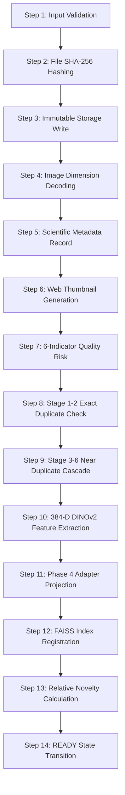

# Scientific Ingestion Pipeline Specification

## Overview
Every micrograph ingested into the SciData Platform undergoes a deterministic, 14-step idempotent pipeline designed to preserve scientific data integrity and prevent repository contamination.

## Step Details
1. **Input Validation**: Verifies file extension (`.tif`, `.tiff`, `.png`, `.jpg`), MIME header, and size limit (50 MB).
2. **File SHA-256 Hashing**: Cryptographic identity calculation before any disk or database modification.
3. **Immutable Storage**: Original file saved to `platform/storage/originals/{sha256}.{ext}` with read-only permissions.
4. **Dimension Decoding**: High-resolution image dimensions, bit depth, and channel count extracted using `ScientificImageReader`.
5. **Metadata Persistence**: Relational record stored with project association, specimen ID, ROI ID, and instrument.
6. **Thumbnail Generation**: Downscaled 256x256 web representation generated for user interface inspection.
7. **Quality-Risk Profiling**: 6 physically grounded metrics calculated:
   - Laplacian Variance (Focus / Defocus)
   - Edge Density (Microstructure definition)
   - Shannon Entropy (Information content)
   - Dynamic Range (Sensor dynamic range)
   - Clipping Ratio (Over/under exposure)
   - High-Frequency FFT Ratio (Blurring detection)
   - Composite Quality Risk ($[0.0, 1.0]$)
8. **Exact Duplicate Check**: File SHA-256 and decoded pixel hash matching against indexed corpus.
9. **Near-Duplicate Cascade**: pHash/dHash Hamming distance ($\le 10$), DINOv2 cosine similarity ($\ge 0.985$), Phase 4 cosine similarity ($\ge 0.985$), and pixel SSIM ($\ge 0.95$).
10. **DINOv2 Feature Extraction**: 384-dimensional L2-normalized visual representation extracted via official Meta DINOv2 ViT-S/14.
11. **Phase 4 Adapter Projection**: Feature projected through verified linear projection head ($384 \to 384$) trained with acquisition-aware SupCon.
12. **FAISS Vector Indexing**: Feature vector added to exact `IndexFlatIP` retrieval index.
13. **Relative Novelty**: k-NN cosine distance computed relative to reference corpus.
14. **State Transition**: Image status transitioned to `READY` and recorded in immutable provenance audit log.
