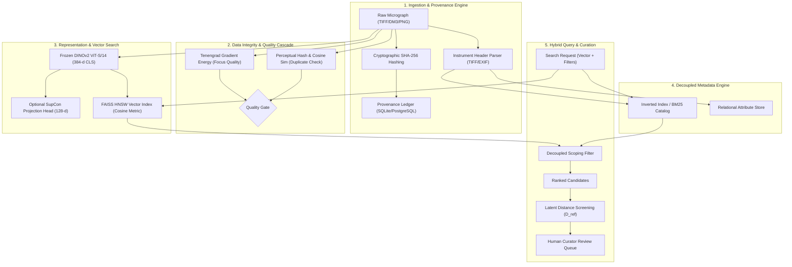

# 3. SYSTEM ARCHITECTURE & ENGINEERING DESIGN

The platform is designed as a modular, decoupled scientific image management engine organized into five cohesive subsystems: Ingestion & Provenance, Representation & Indexing, Metadata Management, Quality & Integrity Screening, and Human-in-the-Loop Curation.

### 3.1 Ingestion & Provenance Subsystem
The ingestion pipeline enforces absolute reproducibility. Each incoming micrograph is assigned an immutable Universally Unique Identifier (UUIDv4) and an end-to-end cryptographic digest (SHA-256). Structural and acquisition parameters (accelerating voltage, working distance, magnification, detector type) are extracted into normalized JSON schemas. Provenance events (ingestion, feature extraction, index addition, curation decisions) are persisted in an append-only relational audit table.

### 3.2 Feature Representation & Vector Indexing Subsystem
Visual representations are extracted using a frozen DINOv2 ViT-S/14 foundation model, producing 384-dimensional $L_2$-normalized latent vectors from the penultimate class token (`[CLS]`). The indexing tier employs a Hierarchical Navigable Small World (HNSW) graph index (`IndexHNSWFlat`) configured with construction parameter $M=16$ and search expansion factor $efSearch=128$. This guarantees sub-millisecond retrieval latencies across large-scale vector collections while preserving 100% recall relative to exhaustive brute-force search.

### 3.3 Decoupled Inverted Indexing
To prevent metadata noise from contaminating geometric vector embeddings, metadata search is strictly decoupled from the dense vector space. A lightweight inverted index manages discrete categorical attributes (mineral phase, detector, specimen ID). During hybrid queries, structured SQL/inverted filters produce candidate candidate masks that scope the HNSW search space, preserving visual ranking integrity without vector space distortion.

### 3.4 Quality, Anomaly, and Curation Subsystems
Incoming micrographs undergo real-time gradient energy screening using the Tenengrad operator:
$$	ext{Tenengrad}(I) = rac{1}{|I|} \sum_{x,y} \left( G_x(x,y)^2 + G_y(x,y)^2 
ight)$$
where $G_x$ and $G_y$ are Sobel spatial derivative filters. Micrographs falling below calibrated thresholds or exhibiting extreme $k$-NN latent distances ($D_{	ext{ref}}$) are routed to an asynchronous triage queue for expert validation.
