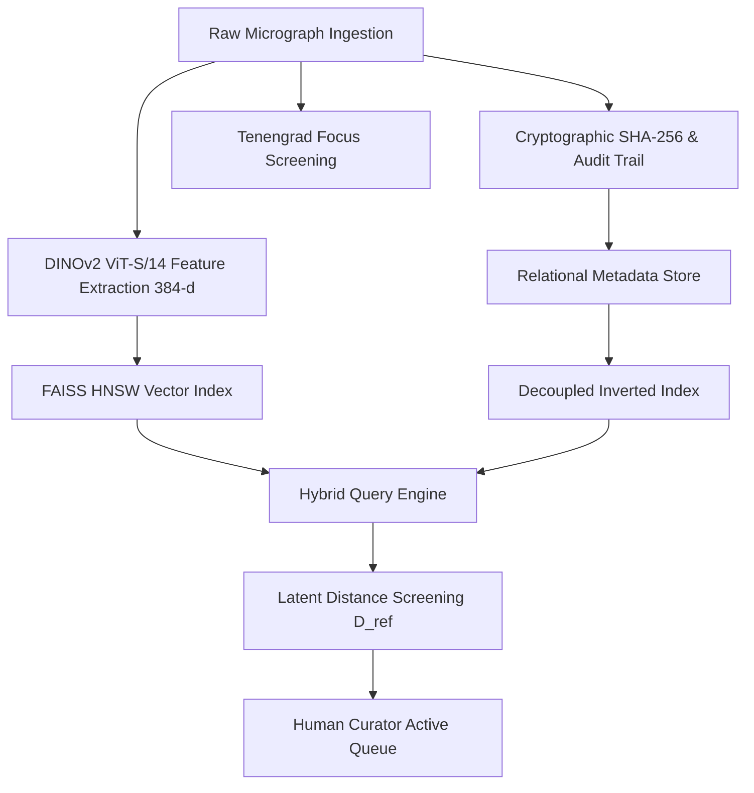

# Figure 1: End-to-End Scientific Image Platform Architecture

**Caption**: Architectural block diagram showing ingestion provenance, quality screening, DINOv2 feature extraction, HNSW indexing, decoupled metadata filtering, and curation triage.

**Figure Type**: Mermaid Flowchart

