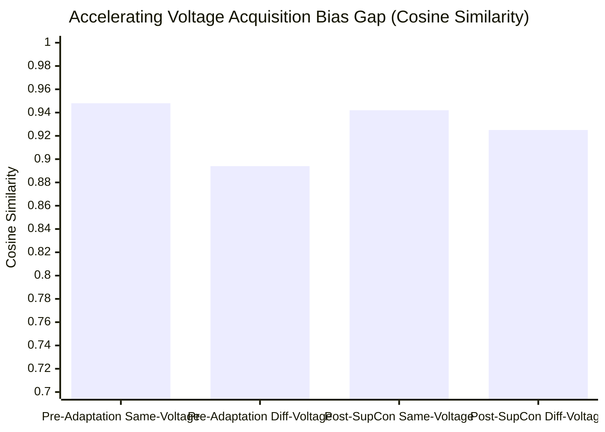

# Figure 2: Accelerating Voltage Acquisition Bias and SupCon Mitigation

**Caption**: Comparison of cosine similarity distributions between same-specimen pairs acquired under varying accelerating voltages before and after SupCon adaptation, illustrating the 68.15% bias gap reduction.

**Figure Type**: Data Specification & Boxplot Schematic

