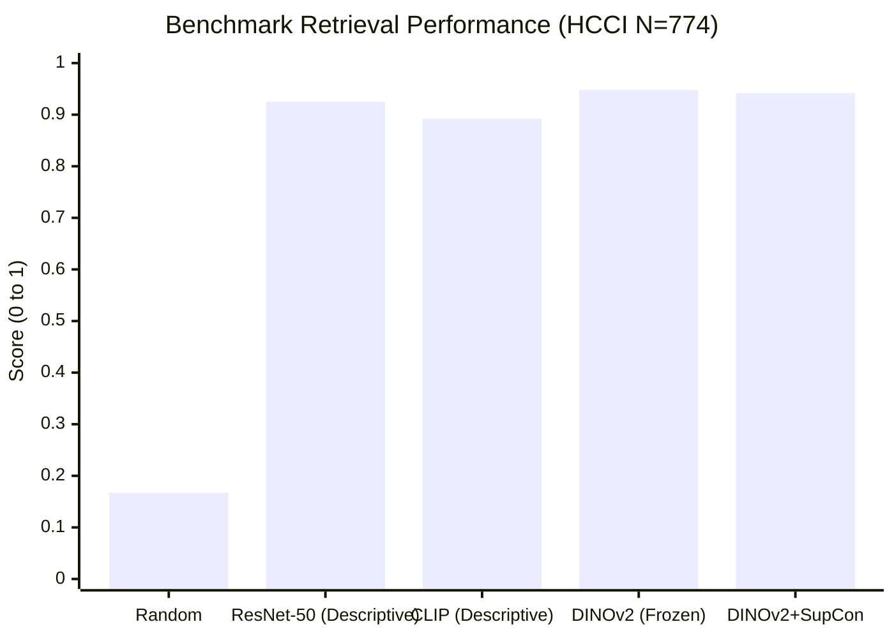

# Figure 3: Retrieval Benchmark Comparison on HCCI Benchmark (N=774)

**Caption**: Bar chart comparing R@1, MRR, and P@5 across Uniform Random, Descriptive ResNet-50, Descriptive CLIP, and DINOv2 ViT-S/14.

**Figure Type**: Data Specification

