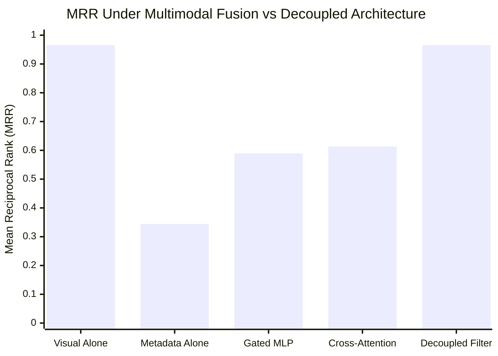

# Figure 4: The Metadata Paradox — Impact of Multimodal Fusion on Retrieval Precision

**Caption**: Visualization showing the drop in MRR when fusing unnormalized instrument metadata into visual representations versus decoupled filtering.

**Figure Type**: Data Specification

