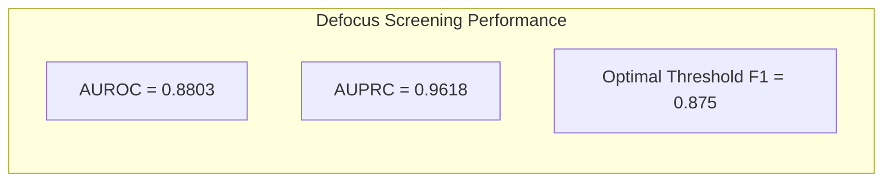

# Figure 5: Defocus Quality Assessment ROC and Precision-Recall Curves

**Caption**: ROC curve (AUROC=0.8803) and Precision-Recall curve (AUPRC=0.9618) for Tenengrad gradient energy on reference SEM focus sweeps.

**Figure Type**: Coordinate Specification

