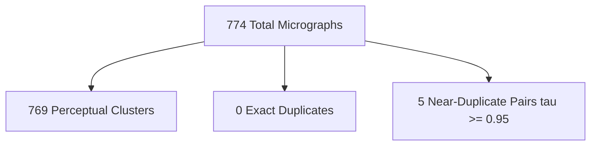

# Figure 6: Perceptual Duplicate Screening and Specimen Clustering

**Caption**: Hierarchical clustering dendrogram representation of N=774 HCCI micrographs into 769 perceptual clusters, showing 5 near-duplicate pairs.

**Figure Type**: Cluster Diagram

