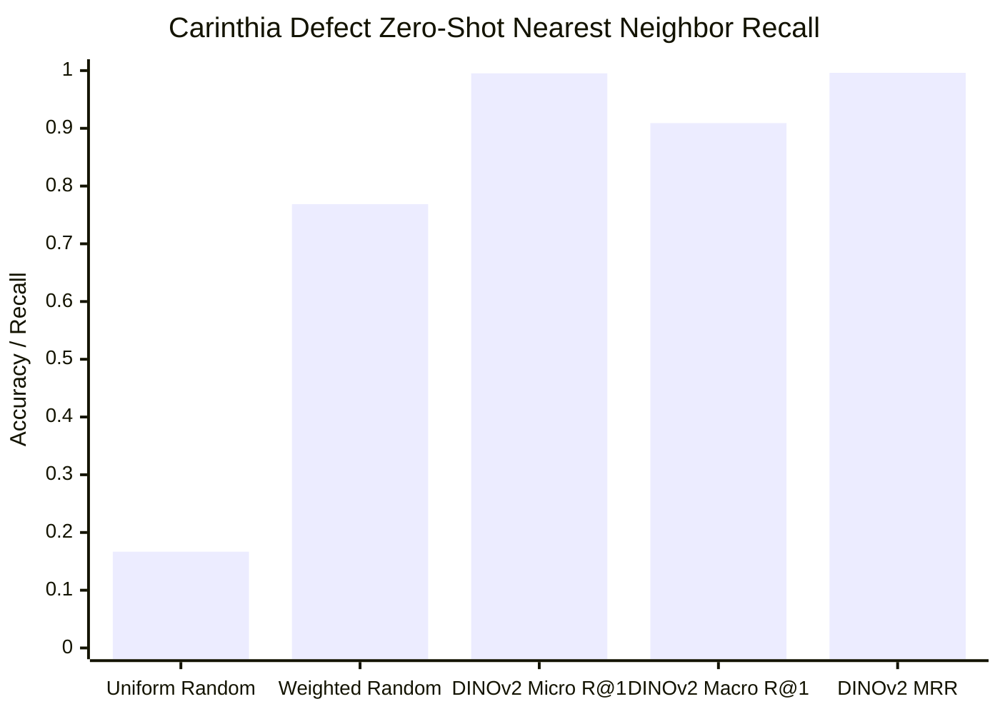

# Figure 7: Zero-Shot Transfer on previously evaluated cross-domain Carinthia defect SEM (N=4,591)

**Caption**: Micro R@1 (0.9952) vs Macro R@1 (0.9090) breakdown showing class imbalance performance across defect categories.

**Figure Type**: Performance Diagram

