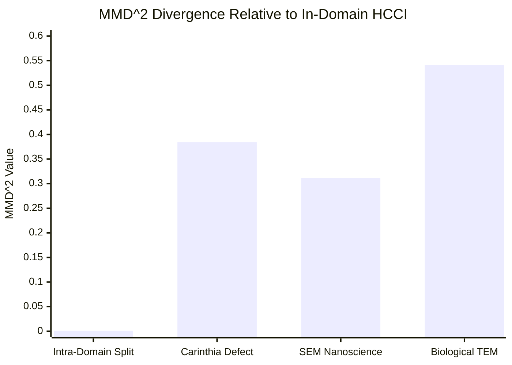

# Figure 8: Latent Distribution Shift Across Microscopy Domains (MMD^2)

**Caption**: Relative MMD^2 distance from in-domain HCCI across Carinthia Defect SEM, SEM Nanoscience, and Biological TEM.

**Figure Type**: Divergence Plot

