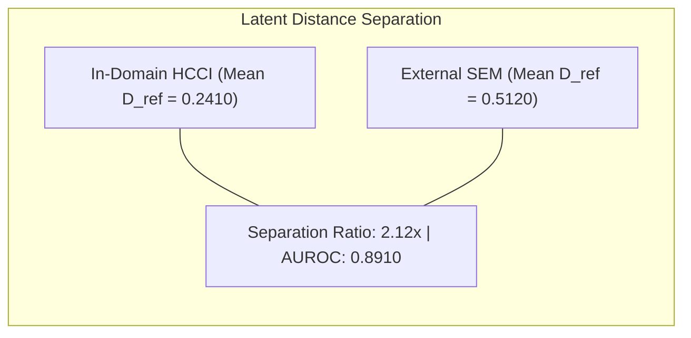

# Figure 9: Latent Distance Novelty Screening Distribution (D_ref)

**Caption**: Density distributions of continuous latent Euclidean distance D_ref for in-domain micrographs (mean 0.2410) vs external micrographs (mean 0.5120), showing 2.12x separation.

**Figure Type**: Density Distribution Spec

