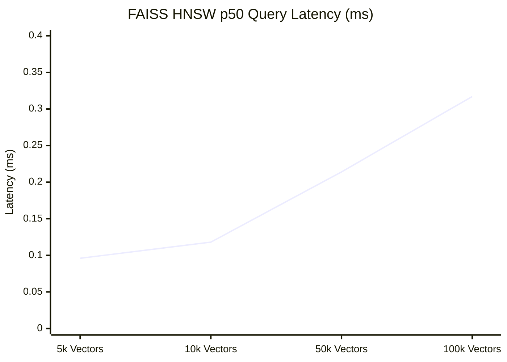

# Figure 10: FAISS HNSW Query Latency Scaling Under Vector Expansion

**Caption**: Sub-millisecond query latency progression (0.096 ms to 0.317 ms) across 5,000 to 100,000 indexed feature vectors.

**Figure Type**: Latency Curve

