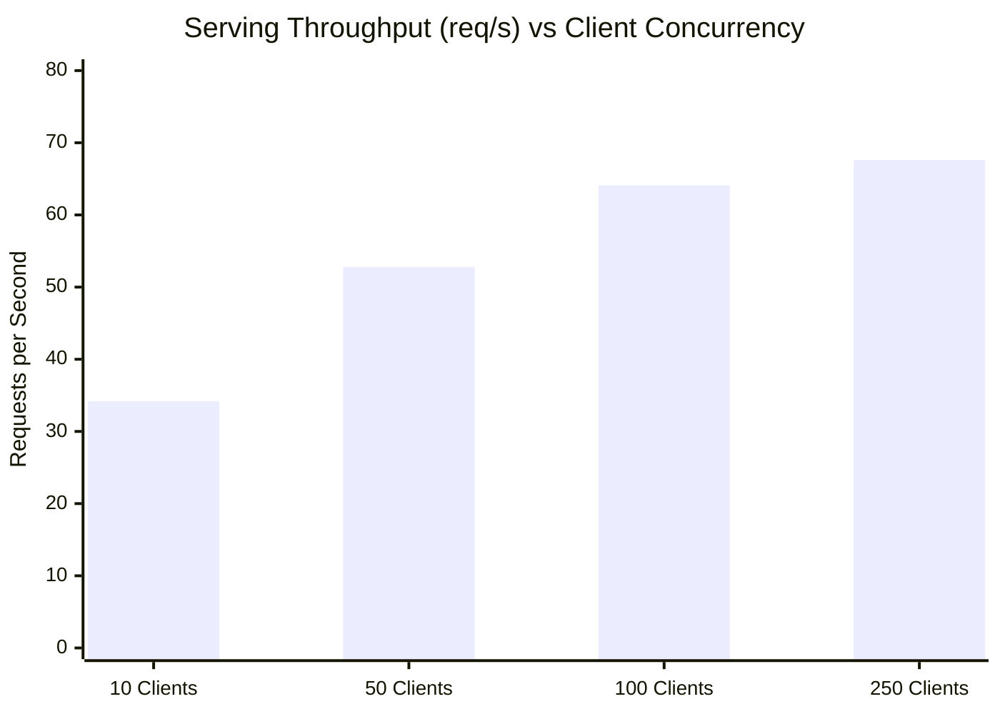

# Figure 11: System Throughput and Latency Under Concurrency Stress

**Caption**: Throughput (peak 67.61 req/s) and p95 latency under concurrency scaling from 10 to 250 simulated client threads.

**Figure Type**: Throughput Scaling

