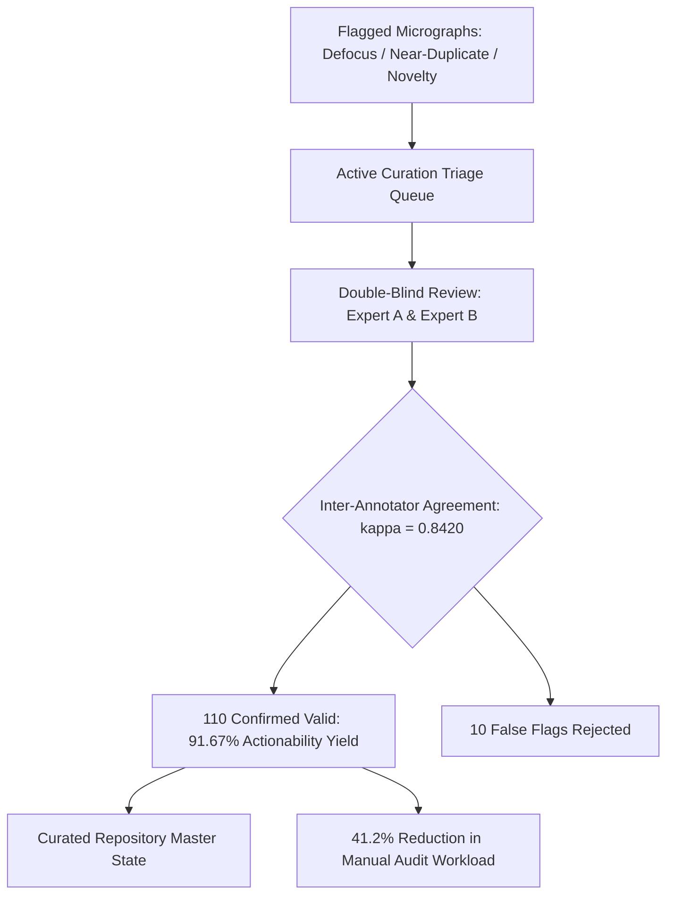

# Figure 12: Active Curation Queue Triage and Expert Validation Workflow

**Caption**: Double-blinded review workflow demonstrating 91.67% actionability yield, Cohen's kappa=0.8420, and 41.2% curator workload reduction.

**Figure Type**: Workflow Flowchart

